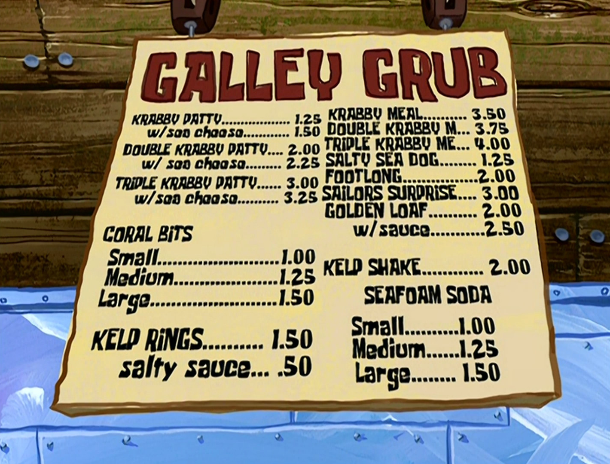
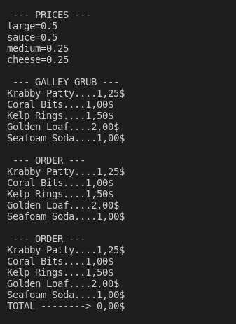
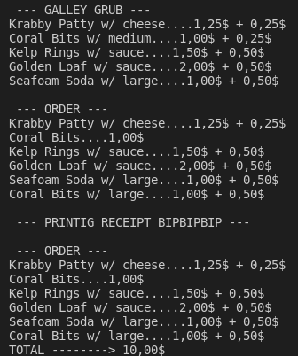
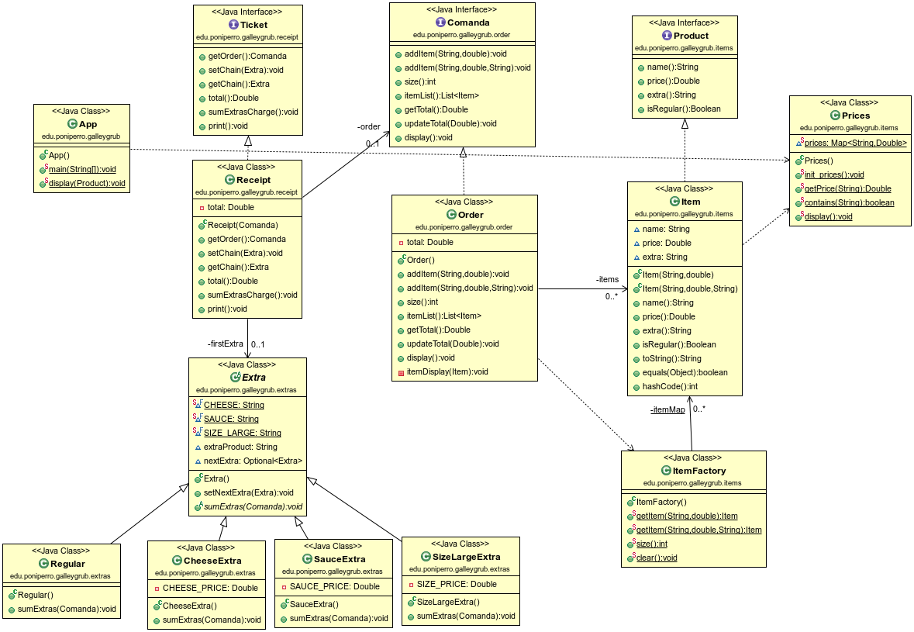

# GALLEY GRUB

## Introducción

Bob Esponja trabaja como cocinero en el Krusty Krab, restaurante famoso por su hamburguesa de autor Krabby Patty.

El restaurante tiene un menu llamado Galley Grub que puedes leer aquí:

https://spongebob.fandom.com/wiki/Galley_Grub

Las comandas son anotadas a mano por Squidward Tentacles.

El propierario Eugene H. Krabs -un agarrao- en vez de adquirir un TPV ha decidido contratar a un estudiante de Dual para que construir un software que calcular el importe total del pedido e imprimir el recibo.
  
Intenta hacer como que programas si no quieres terminar en la cocina ayudando a Bob a preparar Krusty Burguers.

Implementa las historias de usuario con la lógica descrita en el `main` de la clase principal `App.java`. 

Si tienes dudas, puedes observar las historias de usuario _live_ en el capítulo _Pickles_ aquí:

https://www.youtube.com/watch?v=VlxSEEIwwNY&list=PL_181YA7nAlfR_0ro3l6Dh7ReB7AB7Mon

 ## Salida de la aplicación

Cada una de las salidas se corresponde con una de las historias de usuario que se detallan en los epígrafes siguientes.

## Diagrama de clases UML / Arquitectura de la app.

